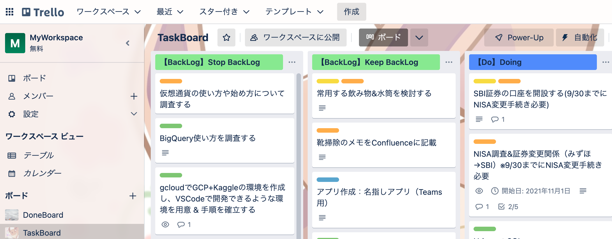
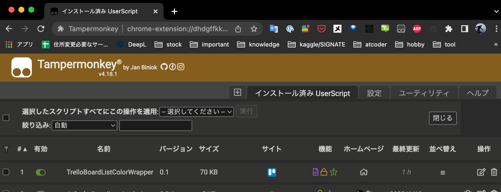

#  **TrelloCustomBoardListColor**

Trelloで設定したスイムレーンのタイトル背景色を変更するUserScriptです。  <br>
自身で設定した文字列に従い、色を変更することができます（下記の緑と青の部分）。<br>
※てか、デフォルトで色変え機能はつけて欲しい、、



<br>

## **環境**
+ *Chrome 108.0.5359.124*<br>
  ※Windows、Macの環境で動作することを確認
+ *Tampermonkey 4.18.1*<br>
  ※Chromeの拡張機能
+ *javascript*

<br>

## **事前準備**

### Tampermonkey

ChromeでUserScriptを使用するためのツールです。<br>
[Chromeウェブストア](https://chrome.google.com/webstore/category/extensions?hl=ja)を開き、`ストアで検索`でTampermonkeyと検索し、`Chromeに追加`を押して導入することができます。<br>
Tampermonkeyを Chromeに追加したら、外部ファイルを使用する設定を実施します。<br>
※参考URL:https://klim0824.hatenablog.com/entry/2018/08/05/052152

#### Chrome拡張の設定
1. Google Chromeの設定から[拡張機能 → Tampermonkeyの詳細]をクリックする。
2. `ファイルのURLへのアクセスを許可する`のチェックをつける。

#### Tampermonkeyの設定
1. Google Chromeの拡張機能ボタンにあるTampermonkeyアイコン → ダッシュボード → 設定 をクリックする。
2. 全般カテゴリーの`設定のモード`を`新参者`から、`上級者`に変更する。
3. セキュリティカテゴリーの`スクリプトによるローカルファイルへのアクセスを許可する`が`Externals (@require and @resource)`となっていることを確認し、ページ下部にある保存ボタンをクリックする。

<br>

## **ツール導入**

Google Chromeの拡張機能ボタンにあるTampermonkeyアイコンを押すと下記の画面が開きます。



この画面の[+]ボタンを押して、下記コードに置き換えます。<br>
(同内容を[wrapper/template_wrapper.js]に記載しています)

```javascript
// ==UserScript==
// @name         TrelloBoardListColorWrapper
// @namespace    http://tampermonkey.net/
// @version      0.1
// @description  custom list color in trello board
// @author       sakagami0615
// @match        https://trello.com/b/*
// @grant        none
// @require      https://code.jquery.com/jquery-3.3.1.slim.min.js
// @require      file:///<put source directory path here>/trello_board_list_color.js
// ==/UserScript==
```
+ 一つ目の`@require`には、JQueryを使用するために外部スクリプトを設定しています。
+ 二つ目の`@require`の\<put source directory path\>には本フォルダのパスを指定します。
+ `@match`に指定したURLにアクセスした時に、`@require`で指定したスクリプトが実行されるようになります(ここではtrelloのページを指定しています)。

※上記以外は、あまり気にしなくても良い設定になります。

<br>

## **ソースコードの説明**

ソースコード内では、スイムレーンのタイトル文字列を確認し、条件に当てはまるものを背景色を変更しています(条件は各自で設定する必要があります)。<br>
設定コードの場所は、下記に記載した`trello_board_list_color`のL50〜L71になります。

```javascript
// リスト名から背景色を取得
function selectListColor(list_name) {

    let color_code = null;

    switch(true) {
        case /^【BackLog】/.test(list_name):
            color_code = "#85eb8a";     // light green
            break;
        case /^【Do】/.test(list_name):
            color_code = "#5a85ff";     // light blue
            break;
        case /^【Temp】/.test(list_name):
            color_code = "#b7b7b7";     // light gray
            break;
        case /^【Done】/.test(list_name):
            color_code = "#777777";     // gray
            break;
    }

    return color_code
}
```
+ switch-caseの条件には、スイムレーンのタイトルと文字の比較結果を記載します。
+ color_code変数には、カラーコードを指定します。

今回は、角括弧内の文字に従ってカラーコードを設定するような処理としています。<br>
この部分をカスタマイズすることで、文字条件および色を変更することができます。
